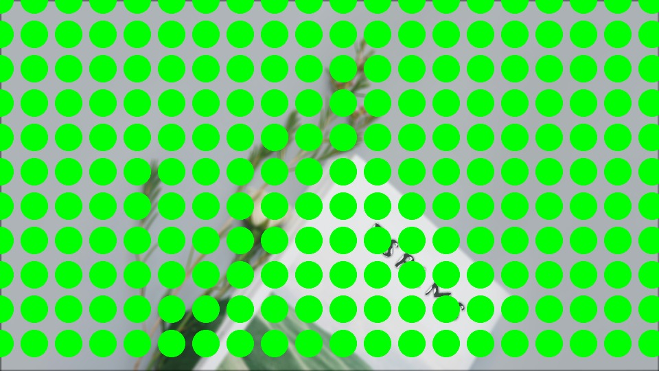

## 1. Select Project Topic: Dyslexia
After some research, I decided that dyslexia was a good topic for this project, and I wanted to bring the unique perspective of dyslexics to the public.

## 2.practise : Custom Pixel

The image above is a photo of a book, processed using a slightly modified version of the [p5.js pointillism example](https://p5js.org/examples/image-pointillism.html). Practice this to get familiar with how the code works.

## 3. practise : Pixel blurring and Warping

I tried blurring the background and using Warping, and drew the eyes on another layer. Because I used 2 blurs, the image was generated very slowly. This made the project slow.
The image above is a photo of a book, processed using a slightly modified version of the [p5.js pixel filter  example](https://github.com/23-2-DSDN242/mddn-242-data-mapping-dribnet/blob/9cf64f5c92846303b5b000cc654f7a2f742d80bb/sketch.js). 
（https://github.com/23-2-DSDN242/mddn-242-data-mapping-dribnet/blob/8102140af8a1de2b7ac0ee6fc219f80a70329b7f/sketch.js）
Practice this to get familiar with how the code works.

## 4. New theme Moon : 

Because AI can't recognize the mask of the picture, I had to change the theme. The new theme is the moon. Inspiration: Mid-Autumn Festival is one of the important traditional festivals in China, which symbolizes reunion and harmony. On this day, families will get together and spend a good time together. One of the symbols of Mid-Autumn Festival is the full moon, which means perfection and happiness.

## 5. Some failed attempts : Chromatic Aberration
Because I tried to make a Chromatic Aberration filter using “mddn-242-data-mapping-dribnet” at first, but failed. Then I tried to write it, using
[p5.js filter  example](https://idmnyu.github.io/p5.js-image/Filters/index.html). 
The idea is to set a new RGB color so that the image color outputs a new RGB color. At the same time, use offset to move the position of the layer to make them produce the effect of Chromatic Aberration.
but it also failed. These are some failed attempts.

## 6. practise : Custom Pixel

Since I had no idea about the Chromatic Aberration filter, I started practicing the pixel filter again, testing the shape size, arrangement, etc.
[p5.js pointillism example](https://p5js.org/examples/image-pointillism.html).

## 7. practise : Chromatic Aberration

Try the Chromatic Aberration filter again. Use the following base 
[p5.js HSB mode  example](https://github.com/23-2-DSDN242/mddn-242-data-mapping-dribnet/blob/5bc33701c75acec7899d248b368b3e21315c2e51/sketch.js) to changes and try again.
Finally, by adding the location of RGB calculation of Chromatic Aberration, the coding can be run.

## 8. practise : scan mask example
Use the 
[p5.js scan mask example](https://github.com/23-2-DSDN242/mddn-242-data-mapping-dribnet/blob/79f02122f235bed44835c835343b9844dc906b10/sketch.js)  to test whether the circle and square can be drawn respectively when the scan center point is on the left or right side. At the same time, a gradient from dark blue to red was painted.

## 9. combine and adjustment : 
Develop the circle and square. Make them similar to the magic circle and the smiley face respectively (try to make them scale with the mask). After combining the Chromatic Aberration filter and the Center Scan filter, make some adjustments to the Chromatic Aberration filter and the smiley face.

